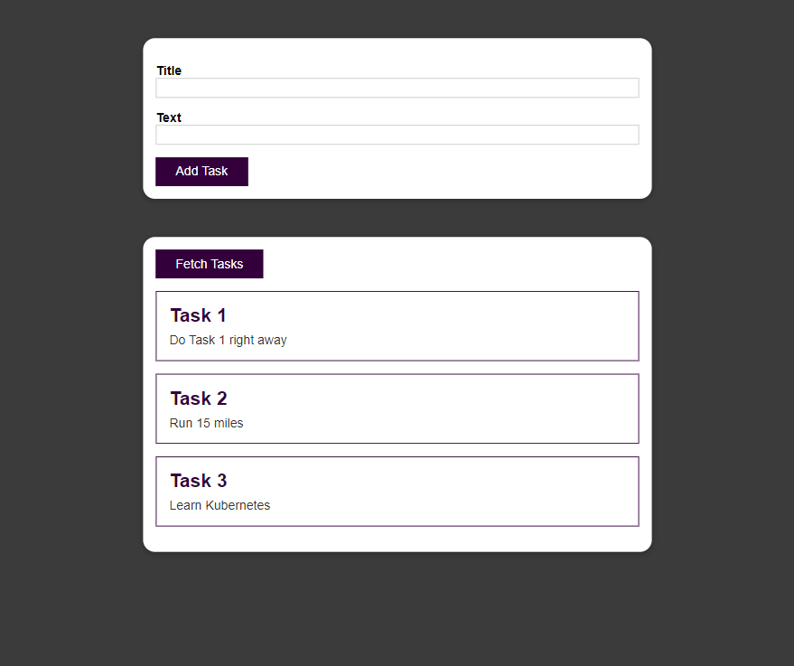

# Tasks App - Docker - Kubernetes 

  ## Description

  A simple task list application built with Docker containers (front end container, auth container, users container, tasks container) and deployed with Kubernetes.  Uses a React front end.

  ### Screenshot of App:
  
  
  ## Table of Contents
  
  - [Installation](#installation)
  - [Usage](#usage)
  - [License](#license)
  - [Contributing](#contributing)
  - [Tests](#tests)
  - [Questions](#questions)
  
  ## Installation
  
  build docker images and push to docker hub. Using kubectl  apply the .yaml files in the kubernetes folder for the various deployemnts and services.  Run via minikube.
  
  ## Usage
  
  Add tasks via the form and fetch tasks using the fetch tasks button.

  ## License
This application is covered under the MIT License.
 For more information: https://opensource.org/licenses/MIT
  
  ## Contributing
  N/A
  
  ## Tests
  N/A

  ## Questions
  Contact Info 
  GitHub user name: BillStephens2022 
  Link to GitHub profile: https://github.com/BillStephens2022 
  Email: stephensbill17@gmail.com